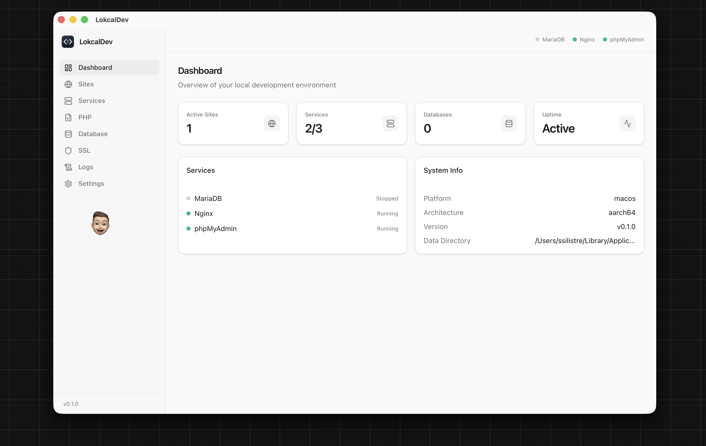
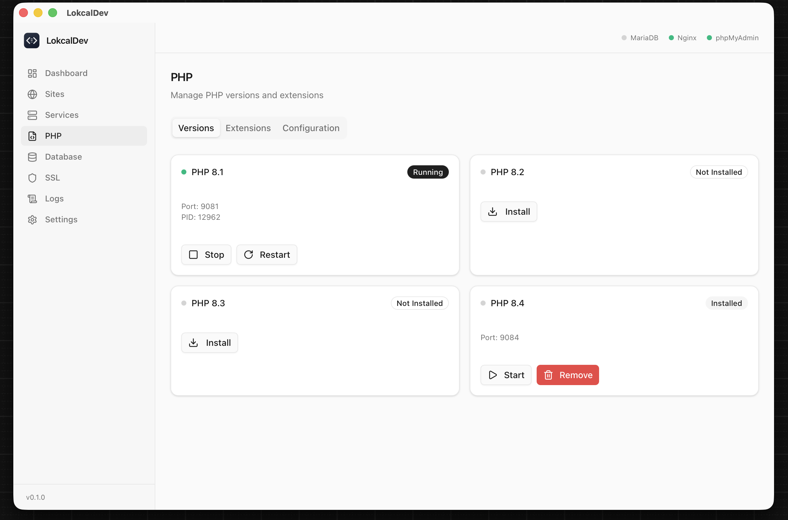
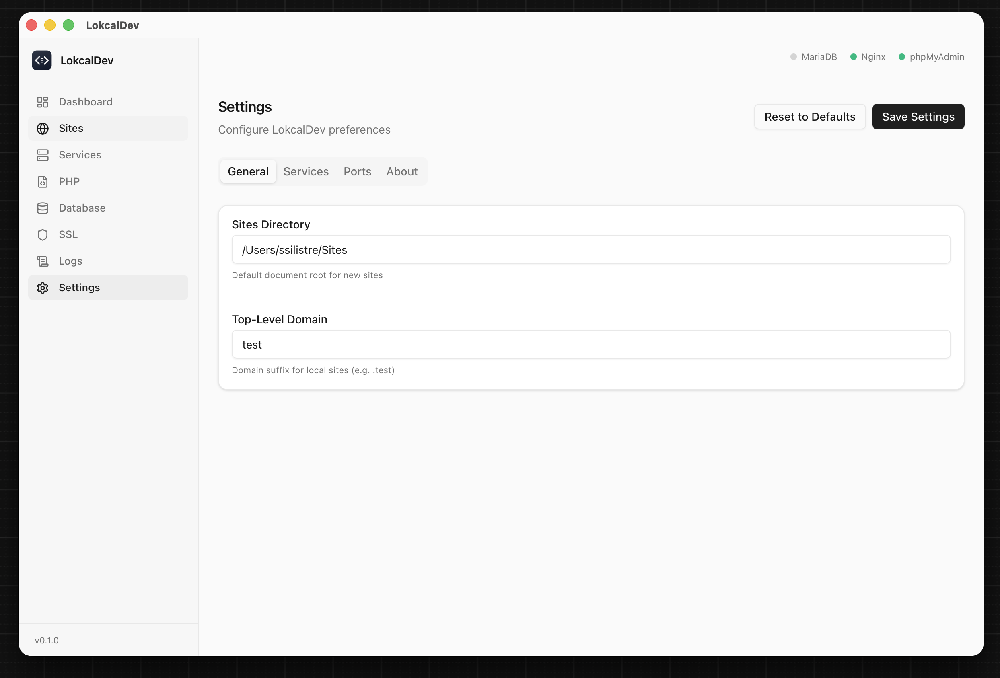

<p align="center">
  
</p>

<h1 align="center">LokcalDev</h1>

<p align="center">
  <strong>A modern local development environment manager for macOS &amp; Windows.</strong><br>
  The lightweight alternative to MAMP PRO and Laravel Herd — built with Tauri, Rust, and React.
</p>

<p align="center">
  <a href="https://github.com/unkownpr/lokcalDev/stargazers"></a>
  <a href="https://github.com/unkownpr/lokcalDev/actions/workflows/release.yml"></a>
  <a href="https://github.com/unkownpr/lokcalDev/releases"></a>
  <a href="https://github.com/unkownpr/lokcalDev/releases/latest"></a>
</p>

<p align="center">
  <a href="https://www.producthunt.com/products/lokcaldev?utm_source=badge-featured&utm_medium=badge&utm_campaign=badge-lokcaldev" target="_blank" rel="noopener noreferrer"></a>
</p>

<p align="center">
  <a href="https://unkownpr.github.io/lokcalDev/">Documentation</a> &bull;
  <a href="#features">Features</a> &bull;
  <a href="#screenshots">Screenshots</a> &bull;
  <a href="#installation">Installation</a> &bull;
  <a href="#tech-stack">Tech Stack</a> &bull;
  <a href="#contributing">Contributing</a> &bull;
  <a href="#license">License</a>
</p>

---

## Why LokcalDev?

Setting up a local PHP development environment shouldn't require a $100/year license or fighting with Docker containers. LokcalDev gives you everything you need in a single, native desktop app.

Manage **PHP**, **Nginx**, **MariaDB**, **SSL certificates**, and **DNS** from one clean interface. No terminal gymnastics, no YAML files, no Docker overhead. Just click and code.

## Features

- **Multi-version PHP** — Install and run PHP 8.1, 8.2, 8.3, and 8.4 side-by-side. Switch versions per site. Manage extensions and `php.ini` from the UI.
- **Nginx Web Server** — Auto-configured virtual hosts, SSL support, and phpMyAdmin integration out of the box. Runs on port 8080 — no password prompts.
- **MariaDB Database** — One-click install, initialize, and manage databases. Comes with phpMyAdmin for visual database management.
- **Site Management** — Create `.test` domains with a single click. Each site gets its own Nginx config, PHP version, and optional SSL. Built-in templates for **WordPress**, **Laravel**, and **Fat-Free Framework** to scaffold projects instantly.
- **SSL Certificates** — Auto-generate trusted local SSL certificates via [mkcert](https://github.com/FiloSottile/mkcert). HTTPS just works.
- **DNS Management** — Automatic DNS resolution via dnsmasq (macOS) or `/etc/hosts` (Windows). Your `.test` domains resolve instantly with zero manual configuration.
- **AI Assistant** — Built-in AI chat powered by [OpenRouter](https://openrouter.ai). Ask it to start services, create sites, write files, and more — with tool calling support.
- **Real-time Logs** — Tail Nginx access/error logs and PHP-FPM logs live from the dashboard.
- **Lightweight & Native** — Built with Tauri 2.0, the app is under 15 MB. No Electron, no bundled Chromium, no bloat.

## Screenshots

<table>
  <tr>
    <td align="center"><strong>Dashboard</strong></td>
    <td align="center"><strong>PHP Management</strong></td>
  </tr>
  <tr>
    <td></td>
    <td></td>
  </tr>
  <tr>
    <td align="center"><strong>AI Assistant</strong></td>
    <td align="center"><strong>Settings</strong></td>
  </tr>
  <tr>
    <td></td>
    <td></td>
  </tr>
</table>

## Installation

### Prerequisites

- **macOS**: [Homebrew](https://brew.sh) (used to install PHP and Nginx)
- **Windows**: No prerequisites — binaries are downloaded automatically

### Download Binary

Download the latest release for your platform:

- **macOS (Apple Silicon):** [Download .dmg](https://github.com/unkownpr/lokcalDev/releases/latest)
- **Windows (x64):** [Download .exe](https://github.com/unkownpr/lokcalDev/releases/latest)

> **macOS Gatekeeper note:** If macOS says the app "is damaged and can't be opened", run this in Terminal after installing:
> ```bash
> xattr -cr /Applications/LokcalDev.app
> ```
> This removes the quarantine flag that macOS adds to downloaded apps.

### From Source

```bash
# Clone the repository
git clone https://github.com/unkownpr/lokcalDev.git
cd lokcalDev

# Install frontend dependencies
pnpm install

# Run in development mode
pnpm tauri dev

# Build for production
pnpm tauri build
```

### Requirements

- [Node.js](https://nodejs.org/) >= 18
- [pnpm](https://pnpm.io/) >= 8
- [Rust](https://rustup.rs/) >= 1.77

## Tech Stack

| Layer | Technology |
|-------|-----------|
| **Desktop Framework** | [Tauri 2.0](https://tauri.app/) |
| **Backend** | Rust |
| **Frontend** | React 19 + TypeScript |
| **Styling** | Tailwind CSS v4 + [shadcn/ui](https://ui.shadcn.com/) |
| **State Management** | Zustand |
| **Routing** | React Router v7 |
| **Package Manager** | pnpm |

## Project Structure

```
LokcalDev/
├── src/                    # React frontend
│   ├── components/         # UI components (layout, shared, shadcn/ui)
│   ├── pages/              # Route pages (Dashboard, Sites, PHP, etc.)
│   ├── stores/             # Zustand state stores
│   ├── hooks/              # Custom React hooks
│   ├── types/              # TypeScript type definitions
│   └── lib/                # Utilities and Tauri bridge
├── src-tauri/              # Rust backend
│   ├── src/
│   │   ├── commands/       # Tauri IPC command handlers
│   │   ├── services/       # Core service managers (PHP, Nginx, MariaDB, SSL...)
│   │   ├── config/         # Path and configuration management
│   │   ├── state.rs        # Application state
│   │   └── error.rs        # Error types
│   └── resources/          # Bundled resources (mime.types, index.php)
└── screenshots/            # Application screenshots
```

## Contributing

LokcalDev's source code is publicly available because we believe transparency builds trust. Developers should be able to see exactly what runs on their machine.

**Your contributions make this project better.** Every bug report, feature suggestion, and pull request directly shapes the tool that thousands of developers rely on every day. Open collaboration drives innovation faster than any closed team ever could.

Here's how you can help:

- **Star this repo** — It helps others discover the project
- **Report bugs** — Open an issue with steps to reproduce
- **Suggest features** — We'd love to hear what you need
- **Submit PRs** — Bug fixes, new features, or documentation improvements are all welcome
- **Spread the word** — Tell your developer friends about LokcalDev

### Development Setup

```bash
# Fork and clone
git clone https://github.com/YOUR_USERNAME/lokcalDev.git
cd lokcalDev

# Install dependencies
pnpm install

# Start development
pnpm tauri dev
```

The Rust backend hot-reloads on save. The React frontend uses Vite HMR.

## Roadmap

- [ ] Redis support
- [ ] PostgreSQL support
- [ ] Node.js version management
- [ ] Composer integration
- [x] Site templates (Laravel, WordPress, Fat-Free Framework)
- [ ] Import/export environment configurations
- [x] Auto-update mechanism
- [x] AI Assistant (OpenRouter integration with tool calling)
- [x] Password-free operation (no sudo for start/stop)
- [x] Auto DNS resolver (dnsmasq on macOS)

## License

This project is **source-available** under the [LokcalDev Source Available License](LICENSE).

You are free to view, study, and use the source code for personal, non-commercial purposes. Commercial use requires a separate license. See the [LICENSE](LICENSE) file for full terms.

For commercial licensing inquiries: **hello@ssilistre.dev**

---

<p align="center">
  Made by <a href="https://ssilistre.dev">ssilistre.dev</a><br>
  Built with frustration towards expensive dev tools and love for the developer community.<br>
  If LokcalDev saves you time, consider giving it a star.
</p>
